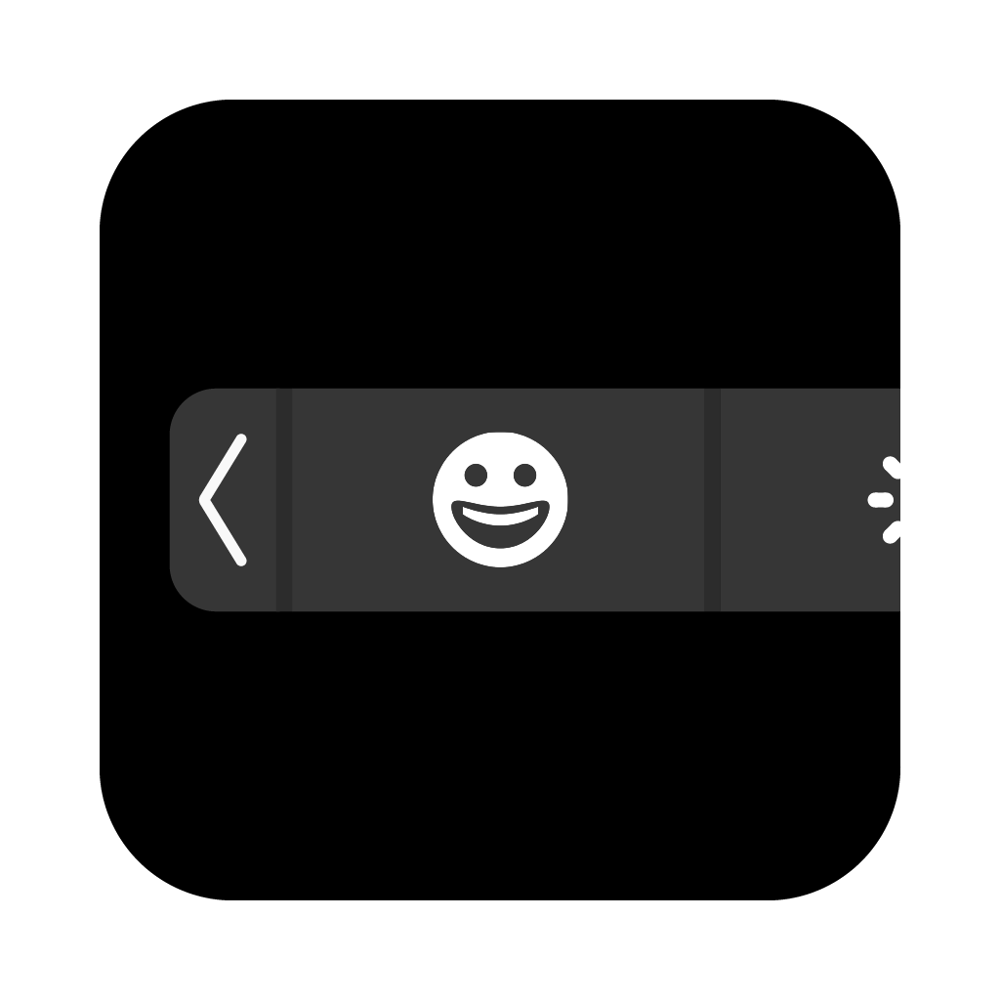

# EmojiBar: A small utility that adds the emoji picker to your Mac's Control Strip.

<table>
  <tr>
    <td width="220" valign="top">
      
    </td>
    <td valign="top">
      <h2>EmojiBar</h2>
      <p>A small menu bar utility that adds a way to access the stock TB emoji picker from the Control Strip.</p>
      <p><b>Download:</b> grab the latest <code>.dmg</code> from the
      <a href="../../releases/latest">Releases page</a>.</p>
    </td>
  </tr>
</table>

## Features

- Shortcut to open the TB emoji picker directly
- Shortcut to enable/disable the Control Strip button
- Auto-open on login
- Show the app icon in dock

## Notes

- The app is unsigned, so you'll need to right (or ctrl+) click the app and select "Open"
- It uses private AppKit APIs, so a future macOS update could break it
- The shortcuts neeed Accessibility permission
- I have not tested it on older macOS versions (Sierra - Monterey), as well as newer ones (Sonoma - Tahoe). Also, I have not tested it on any arm64e Macs, since my machine has an Intel CPU

## Building from source

```bash
python3 -m pip install pyobjc-framework-Cocoa pyobjc-framework-Quartz pyinstaller
python3 -m PyInstaller --noconfirm --clean EmojiBar.spec
```

## *AI USAGE NOTE:*
*The code for project was made with the use of AI, Claude to be specific. The icon, title, and almost all text/graphics/design in the app, as well as the text in this readme, were created by me.*
